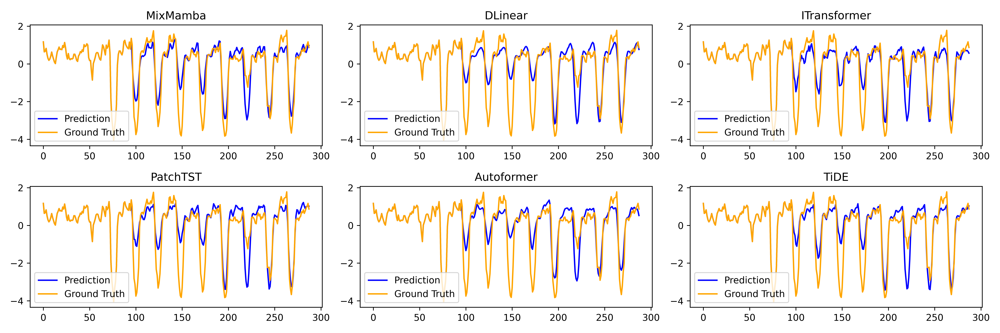
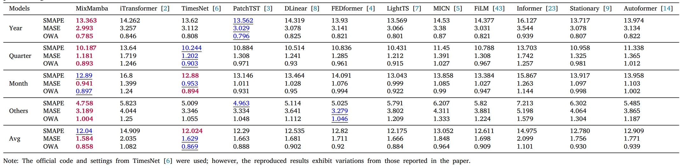

# MixMamba
This repository is the official implementation of the paper: [MixMamba: Time Series Modeling with Adaptive Expertise](https://www.sciencedirect.com/science/article/pii/S1566253524003671)

## Introduction
The heterogeneity and non-stationary characteristics of time series data continue to challenge single models’ ability to capture complex temporal dynamics, especially in long-term forecasting. Therefore, we propose **MixMamba** that:
+ Leverages the [Mamba](https://arxiv.org/abs/2312.00752) model as an expert within a _mixture-of-experts_ ([MoE](https://arxiv.org/abs/2308.00951)). This framework decomposes modeling into a pool of specialized experts,
enabling the model to learn robust representations and capture the full spectrum of patterns present in time series data. 
+ A dynamic gating network is introduced to adaptively allocates each data segment to the most suitable expert based on its characteristics allows the model to adjust dynamically to temporal changes in the underlying data distribution.
+ To prevent bias towards a limited subset of experts, a load balancing loss function is incorporated.

## Schematic Architecture
MixMamba is a time series forecasting model that utilizes a mixture-of-experts (MoM) approach. The model's architecture consists of four primary stages:
- **Pre-processing**: Raw time series data undergoes normalization and segmentation to create patches.
- **Embedding and Augmentation**: Patches are embedded and augmented with positional information to provide context.
- **MoM Block**: This central component consists of multiple Mamba experts coordinated by a gating network. Each Mamba expert employs a series of projections, convolutions, selective SSM, and a skip connection to learn temporal dependencies.
- **Prediction Head**: A linear prediction head is used to generate final outputs based on the learned representations.
  


## Algorithms
<p align="center">
  
  
  
</p>

## Forecasting Plots
<figure>
  
  <figcaption>
    <div align="center">Long-term Forecasting with 𝐿 = 96 and 𝑇 = 192 on ETTh1.</div>
  </figcaption>
</figure>


<figure align="center">
  
  <figcaption>
    <div align="center">Long-term Forecasting with 𝐿 = 96 and 𝑇 = 192 on Weather.</div>
  </figcaption>
</figure>

<figure>
  
  <figcaption>
    <div align="center">Short-term Forecasting on M4 (Yearly).</div>
  </figcaption>
</figure>

## Usage
1. To install the required dependencies, run the following command:
```pip install -r requirements.txt ```
2. Datasets can be downloaded from either [Google Drive](https://drive.google.com/drive/folders/13Cg1KYOlzM5C7K8gK8NfC-F3EYxkM3D2) or [Baidu Drive](https://pan.baidu.com/s/1r3KhGd0Q9PJIUZdfEYoymg?pwd=i9iy). After downloading, place the data in the ```./dataset``` folder.
3. Train and evaluate the model using the scripts provided in the ```./scripts/``` directory. Please refer to the following example for a step-by-step guide on reproducing the experimental results:
  - **Long-term forecasting**: ```bash ./scripts/long_term_forecast/ETT_script/mixmamba_ETTh1.sh```
  - **Short-term Forecasting**: ```bash ./scripts/short_term_forecast/mixmamba_M4.sh```
  - **Classification**:  ```bash ./scripts/classification/mixmamba.sh```

## Main Results

<figure>
    <figcaption>
    <div align="center"><b>Multivariate Long-term Forecasting.</b>></div>
  </figcaption>
  
</figure>


<figure align="center">
    <figcaption>
    <div align="center"><b>Multivariate Short-term Forecasting.</b></div>
  </figcaption>
  
</figure>

<figure>
  <figcaption>
    <div align="center"><b>Classification.</b></div>
  </figcaption>
  
</figure>

## Model Analysis
- Mixmamba performance under varied look-back window length \𝐿 ∈ {96, 192, 336, 720}\ on PEMS03 datasets (\𝑇 = 720\) (**Upper left**).
- Comparison of learned representations for different experts on ETTm1 dataset with \𝐿 = 96, 𝑇 = 720\ (**Upper right**).
- Comparison of memory usage (Up) and computation time (Down) on ETTm2 dataset (Batch size is set to 32) (**Down left**).
- Hyperparameters analysis on exchange and ILI datasets (\𝐿 = 96, 𝑇 = 720\). (**Down right**)
<p align="center">


</p>
<p align="center">


</p>

## Acknowledgement
We'd like to express our gratitude to the following GitHub repositories for their exceptional codebase:

https://github.com/thuml/Time-Series-Library

https://github.com/yuqinie98/PatchTST

https://github.com/thuml/iTransformer
